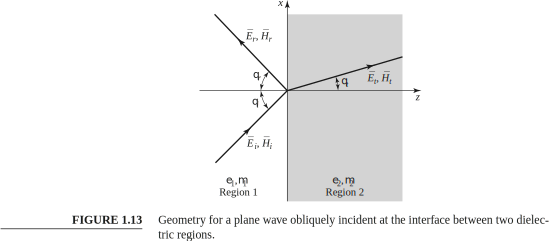

Microwave Engineering, Fourth Edition, David M. Pozar  
1.8 OBLIQUE INCIDENCE AT A DIELECTRIC INTERFACE  
  
**Parallel Polarization**  
```math
\mu_1 = \mu_2 = \mu_o \newline  {}\newline
k_1 = \omega \sqrt{\mu_o\varepsilon_1} \newline  {}\newline
k_2 = \omega \sqrt{\mu_o\varepsilon_2} \newline  {}\newline
\eta_1 = \sqrt \frac {\mu_o}{\varepsilon_1} \newline  {}\newline
\eta_2 = \sqrt \frac {\mu_o}{\varepsilon_2} \newline  {}\newline
\frac {\eta_1}{\eta_2} = \sqrt \frac {\varepsilon_2}{\varepsilon_1} \newline  {}\newline
\frac{k_1}{k_2} = \sqrt{\frac{\varepsilon_1}{\varepsilon_2}} \newline  {}\newline
```  

**Snell’s laws**
```math
\theta_i = \theta_r \newline  {}\newline
k_1 \sin\theta_i = k_2 \sin\theta_t \newline  {}\newline
\sin\theta_t = \frac {k_1}{k_2} \sin\theta_i = \sqrt{\frac{\varepsilon_1}{\varepsilon_2}} \sin\theta_i \newline  {}\newline
\cos^2\theta_t = 1-\sin^2\theta_t = 1- {\frac{\varepsilon_1}{\varepsilon_2}} \sin^2\theta_i \newline  {}\newline
\Gamma = \frac {\eta_2 \cos \theta_t - \eta_1 \cos \theta_i}{\eta_2 \cos \theta_t + \eta_1 \cos \theta_i} \newline  {}\newline
```
หา $`\theta_i = \theta_b`$ (Brewter Angle) ที่ทำให้ reflection coefficient เป็นศูนย์  
```math
\Gamma = 0  \newline  {}\newline
\eta_2 \cos \theta_t = \eta_1 \cos \theta_b  \newline  {}\newline
\cos \theta_t = \frac{\eta_1}{\eta_2} \cos \theta_b = \sqrt{\frac{\varepsilon_2}{\varepsilon_1} }\cos \theta_b  \newline  {}\newline
\cos^2 \theta_t = {\frac{\varepsilon_2}{\varepsilon_1} }\cos^2\theta_b  \newline  {}\newline
 1- {\frac{\varepsilon_1}{\varepsilon_2}} \sin^2\theta_b = {\frac{\varepsilon_2}{\varepsilon_1} }\cos^2\theta_b  \newline  {}\newline
```
```math
 1- {\frac{\varepsilon_1}{\varepsilon_2}} \sin^2\theta_b+{\frac{\varepsilon_2}{\varepsilon_1} }\sin^2\theta_b  = {\frac{\varepsilon_2}{\varepsilon_1} }\cos^2\theta_b+{\frac{\varepsilon_2}{\varepsilon_1} }\sin^2\theta_b  \newline  {}\newline
 1- {\frac{\varepsilon_1}{\varepsilon_2}} \sin^2\theta_b+{\frac{\varepsilon_2}{\varepsilon_1} }\sin^2\theta_b  = {\frac{\varepsilon_2}{\varepsilon_1} }  \newline  {}\newline
 \left( -\frac{\varepsilon_1}{\varepsilon_2} +\frac{\varepsilon_2}{\varepsilon_1}  \right) \sin^2\theta_b  = \frac{\varepsilon_2}{\varepsilon_1}-1   \newline  {}\newline
\left( \frac{\varepsilon^2_2-\varepsilon^2_1}{\varepsilon_1 \varepsilon_2}\right) \sin^2\theta_b  = \frac{\varepsilon_2}{\varepsilon_1}-1   \newline  {}\newline
\left( \frac{\varepsilon^2_2-\varepsilon^2_1}{\varepsilon_1 \varepsilon_2}\right) \sin^2\theta_b  = \frac{\varepsilon_2-\varepsilon_1}{\varepsilon_1}   \newline  {}\newline

```
```math
\left( \frac{\left(\varepsilon_2+\varepsilon_1\right)\left(\varepsilon_2-\varepsilon_1\right)}{\varepsilon_2}\right) \sin^2\theta_b  = \frac{\varepsilon_2-\varepsilon_1}{1}   \newline  {}\newline

\left( \frac{\left(\varepsilon_2+\varepsilon_1\right)}{\varepsilon_2}\right) \sin^2\theta_b  = 1   \newline  {}\newline

\left( 1+ \frac{\varepsilon_1}{\varepsilon_2}\right) \sin^2\theta_b  = 1   \newline  {}\newline

 \sin^2\theta_b  = \frac {1}{\left( 1+ \frac{\varepsilon_1}{\varepsilon_2}\right)}   \newline  {}\newline
```
เราจะได้สมการที่ 1.138 หน้าที่ 37 ใน textbook  
```math

 \sin\theta_b  = \sqrt{\frac {1}{\left( 1+ \frac{\varepsilon_1}{\varepsilon_2}\right)} }  \newline  {}\newline

```
