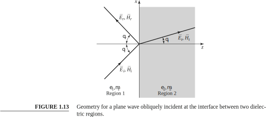

Microwave Engineering, Fourth Edition, David M. Pozar  
1.8 OBLIQUE INCIDENCE AT A DIELECTRIC INTERFACE  
  
**Perpendicular Polarization**  
```math
\mu_1 = \mu_2 = \mu_o 
```
```math 
k_1 = \omega \sqrt{\mu_o\varepsilon_1} \newline  {}\newline
```
```math 
k_2 = \omega \sqrt{\mu_o\varepsilon_2} \newline  {}\newline
```
```math 
\eta_1 = \sqrt \frac {\mu_o}{\varepsilon_1} \newline  {}\newline
```
```math 
\eta_2 = \sqrt \frac {\mu_o}{\varepsilon_2} \newline  {}\newline
```
```math 
\frac {\eta_1}{\eta_2} = \sqrt \frac {\varepsilon_2}{\varepsilon_1} \newline  {}\newline
```
```math 
\frac{k_1}{k_2} = \sqrt{\frac{\varepsilon_1}{\varepsilon_2}} \newline  {}\newline
```  

**Snell’s laws**
```math
\theta_i = \theta_r \newline  {}\newline
```
```math 
k_1 \sin\theta_i = k_2 \sin\theta_t \newline  {}\newline
```
```math 
\sin\theta_t = \frac {k_1}{k_2} \sin\theta_i = \sqrt{\frac{\varepsilon_1}{\varepsilon_2}} \sin\theta_i \newline  {}\newline
```
```math 
\cos^2\theta_t = 1-\sin^2\theta_t = 1- {\frac{\varepsilon_1}{\varepsilon_2}} \sin^2\theta_i \newline  {}\newline
```


```math
\Gamma = \frac {\eta_2 \cos \theta_i - \eta_1 \cos \theta_t}{\eta_2 \cos \theta_i + \eta_1 \cos \theta_t} \newline  {}\newline
```
หา Brewster angle $`\theta_i = \theta_b`$ ที่ทำให้ reflection coefficient เป็นศูนย์ 
```math
\Gamma = 0  \newline  {}\newline
```
```math 
\eta_2 \cos \theta_i = \eta_1 \cos \theta_t  \newline  {}\newline
```
```math 
\eta_2^2 \cos^2 \theta_i = \eta_1^2 \cos^2 \theta_t \newline {}\newline
```
```math 
\eta_2^2 \cos^2 \theta_i = \eta_1^2 \left( 1- \left( \frac{k_1^2}{k_2^2} \right) \sin^2 \theta_i \right) \newline {}\newline
```
```math 
\eta_2^2 \cos^2 \theta_i = \eta_1^2 - \eta_2^2 \left( \frac{k_1^2}{k_2^2} \right) \sin^2 \theta_i \newline {}\newline
```
```math 
k_2^2 \eta_2^2 \cos^2 \theta_i = k_2^2 \eta_1^2 - \eta_1^2 k_1^2 \sin^2 \theta_i \newline {}\newline
```
```math 
k_2^2 \eta_2^2 \cos^2 \theta_i + k_2^2 \eta_2^2 \sin^2 \theta_i = k_2^2 \eta_1^2 - \eta_1^2 k_1^2 \sin^2 \theta_i + k_2^2 \eta_2^2 \sin^2 \theta_i \newline {}\newline
```
```math 
k_2^2 \eta_2^2 = k_2^2 \eta_1^2 + \left( -\eta_1^2 k_1^2 + k_2^2 \eta_2^2 \right) \sin^2 \theta_i \newline {}\newline
```
และจะได้สมการ
```math
k_2^2 \left( \eta_2^2 - \eta_1^2 \right) = \left( k_2^2 \eta_2^2 - k_1^2 \eta_1^2 \right) \sin^2 \theta_i \newline {}\newline
```  
จากสมการด้านบน แสดงให้เห็นว่า Perpendicular Polarization ไม่มี Brewster angle เนื่องจาก 
```math
k_2^2 \eta_2^2 - k_1^2 \eta_1^2 = \omega^2 \mu_2 \varepsilon_2 \frac{\mu_2}{\varepsilon_2}-\omega^2 \mu_1 \varepsilon_1 \frac{\mu_1}{\varepsilon_1}\newline  
k_2^2 \eta_2^2 - k_1^2 \eta_1^2 = \omega^2 (\mu^2_2- \mu^2_1)  
```  
สำหรับสาร dielectric $`\mu_1=\mu_2=\mu_o`$ ดังนั้น $`k_2^2 \eta_2^2 - k_1^2 \eta_1^2=0`$  แต่ด้านขวาของสมการ $`k_2^2 \left( \eta_2^2 - \eta_1^2 \right) \neq 0`$  
